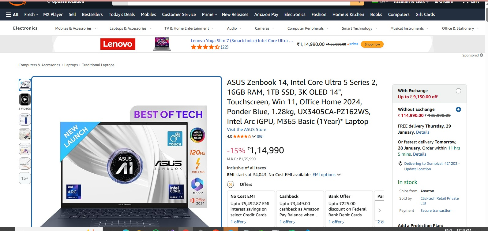
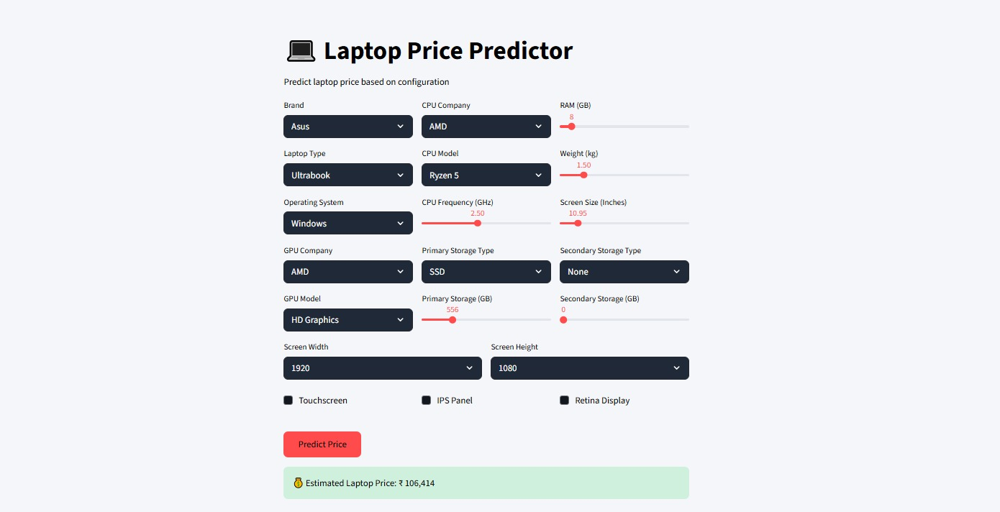

# 💻 Laptop Price Predictor

This project predicts laptop prices based on user-selected hardware configurations using Machine Learning.

📌 **Internship Task**  
This is the **3rd project** developed during my internship at **Unified Mentor**.

---

## 🚀 Project Overview
The Laptop Price Predictor is a machine learning application that estimates laptop prices based on specifications such as brand, processor, RAM, storage, display, and more.

The project covers the complete ML lifecycle:
- Exploratory Data Analysis
- Feature Engineering
- Model Training
- Model Deployment using Streamlit

---

## 📊 Dataset
- Source: Kaggle
- Format: CSV
- Records: ~1300 laptop models

---

## 🧠 Technologies Used
- Python
- Pandas, NumPy
- Scikit-learn
- Streamlit
- Matplotlib, Seaborn

---

## 🖥️ Price Comparison (Real vs Predicted)

### Amazon Real Price

### Model Predicted Price (Dashboard)

➡️ The predicted price is closely aligned with real-world market prices.

---

## 🌐 Live Dashboard
🔗 **Live App Link:** (After deployment, paste Streamlit link here)

---

## 🔐 Security
- No personal data is collected
- Only hardware configuration inputs are used
- Safe for public access and deployment

---

## 📌 Internship Details
- Organization: **Unified Mentor**
- Project Type: Machine Learning + Deployment
- Role: Data Science Intern

---

## 👩‍💻 Author
**Meenakshi Thombare**

